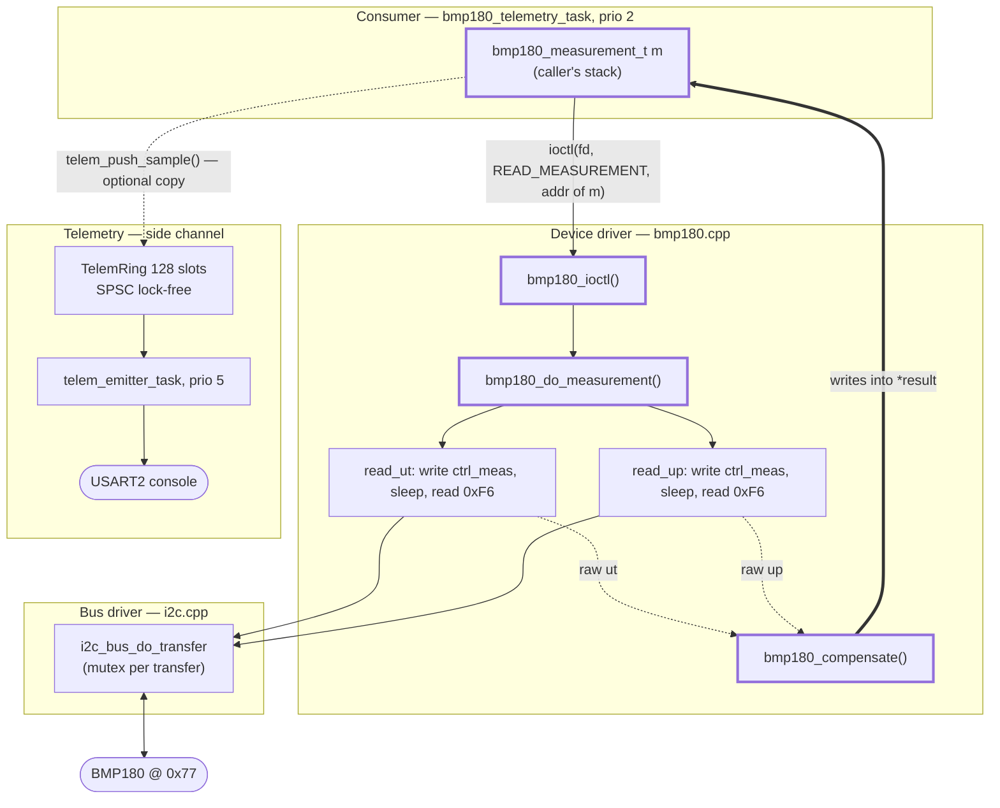
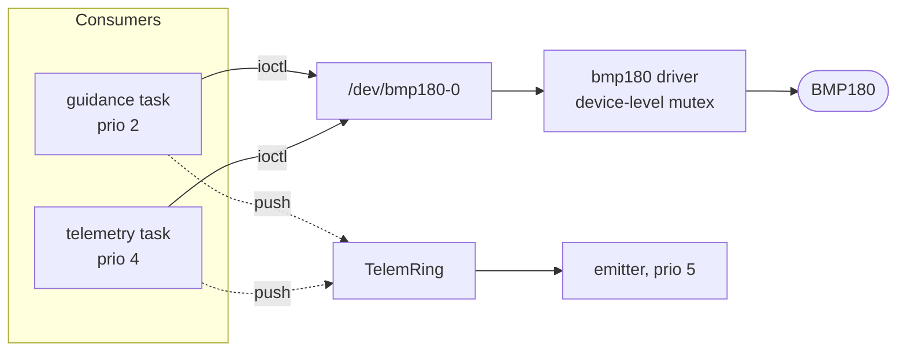

# Architecture and Data Flow

How a pressure reading gets from the sensor to a consumer, and where telemetry
attaches. Companion to [`TELEMETRY_DESIGN.md`](TELEMETRY_DESIGN.md), which covers
the wire format and host tooling; this page covers the on-device path.

**As-built at v1.1.0.** Line references are current as of that tag.

---

## The short answer

The ring buffer sits **beside** the measurement path, not inside it.

A measurement is delivered **synchronously**, by direct write into a struct the
caller owns. `ioctl` returns and the data is already there. The consumer *then*
chooses to copy that value into the telemetry ring, as a separate act.

Compile telemetry out entirely and the consumer still gets every measurement at
the same rate, by the same mechanism. That is the property worth protecting: a
dropped telemetry record costs a log line, never a reading.

---

## Live path (v1.1.0)

Outlined nodes and the thick edge are the measurement path. Everything past the
dotted edge is observation, and can stall or drop without affecting anything
above it.

### Step by step

| # | Where | What happens |
|---|-------|--------------|
| 1 | `sensor.cpp:244` | Consumer opens `/dev/bmp180-0` once, keeps the fd |
| 2 | `sensor.cpp:295` | `ioctl(fd, BMP180_IOCTL_READ_MEASUREMENT, &m)` — `m` is a plain struct on the consumer's stack |
| 3 | RTEMS libio | Dispatches to the node's `ioctl` handler |
| 4 | `bmp180.cpp:248` | `bmp180_ioctl()` casts `arg` back to `bmp180_measurement_t*` |
| 5 | `bmp180.cpp:216` | `bmp180_do_measurement(self, result)` — `result` **is** the caller's `&m` |
| 6 | `bmp180.cpp:229` | `read_ut`: write `ctrl_meas`, `wake_after`, read 2 bytes from `0xF6` |
| 7 | `bmp180.cpp:235` | `read_up`: write `ctrl_meas`, `wake_after`, read 3 bytes from `0xF6` |
| 8 | `bmp180.cpp:240` | `bmp180_compensate()` writes the compensated values **directly into `m`** |
| 9 | `sensor.cpp:295` | `ioctl` returns 0. **`m` is complete. This is the sensor's output.** |
| 10 | `sensor.cpp:301` | Consumer copies the values into a `telem_rec_t` and pushes to the ring |
| 11 | `telemetry.cpp:126` | Emitter pops, formats to text, one `write(STDOUT_FILENO)` |

Steps 1–9 are the driver contract. Steps 10–11 are optional and belong to the
consumer, not the driver.

### What the numbers cost

| | |
|---|---|
| Copies into `m` | **1** — `bmp180_compensate` writes the caller's struct in place |
| Extra copies for a non-telemetry consumer | **0** |
| Extra copies for telemetry | **2** — struct into `telem_rec_t`, then by value into the ring slot |
| Ring record | 24 bytes; ring total ~3 KB |
| Blocking in the measurement path | Two `rtems_task_wake_after` sleeps only. No queue, no lock beyond the per-transfer bus mutex |
| Blocking from telemetry | **None.** `push()` is wait-free: full ring increments a counter and returns `false` |

Measured over two 150 s captures: **zero drops in 15 149 samples**
([`../E_analysis/BASELINE.md`](../E_analysis/BASELINE.md)). The side channel has
never once back-pressured acquisition.

---

## Why the tap is consumer-side

The alternative is pushing to the ring from inside `bmp180_ioctl`, which would
instrument every consumer automatically. Rejected deliberately:

- It welds a logging transport into a device driver, which is what stops the
  driver being reusable in any other application.
- It makes the driver's timing depend on telemetry configuration.
- It removes the consumer's ability to *not* be logged.

The accepted cost is that **each consumer must push explicitly**, or its traffic
is invisible in the stream. That's a real drawback and the reason it is written
down here rather than left implicit.

---

## Target architecture

Once the sweep profile has served its purpose, the consumer is a guidance task
and telemetry becomes a second, lower-priority observer:

**This is what makes [I1](../KNOWN_ISSUES.md#i1--a-measurement-is-not-atomic-on-the-bus)
a blocker rather than an improvement.** One measurement is four I²C transfers
with sleeps between them, and `i2c_bus_do_transfer` holds the bus mutex for
**one transfer at a time**. Two consumers each trigger conversions into the
other's sleep window and read each other's results — silently, since the sensor
returns the previous conversion rather than an error.

Today there is exactly one opener, so the defect cannot fire. Adding the second
consumer is what arms it. The fix is a mutex at the *device* level, held across
the whole `bmp180_do_measurement` sequence, not at the transfer level.

`self->oss` needs the same protection: it is read and written with no
synchronisation, and it selects both the control byte and the compensation
shift.

---

## Notes on the current implementation

Observations from tracing the path. None are bugs; recorded so they are not
rediscovered.

**The telemetry timestamp is a completion time.** `telem_now_us()` is called
*after* `ioctl` returns (`sensor.cpp:301`), so `t_us` marks when the measurement
finished, not when it was triggered. Consistent across every record, so interval
and jitter maths is unaffected — every figure in `BASELINE.md` is a difference of
two of these. Only absolute latency-to-trigger would need the other convention,
and nothing measures that.

**The emitter polls.** When the ring drains it sleeps one tick
(`telemetry.cpp:143`) and re-checks. At ~111 Hz acquisition and ~500 lines/s
drain capacity the ring is empty most of the time, so this is a wake-up every
millisecond that usually finds nothing. Harmless at priority 5 — it only ever
runs in the gaps where acquisition is sleeping on a conversion — but an RTEMS
event or a counting semaphore signalled from `push()` would be the tidier
construction. Not worth changing while the profile is throughput-bound.

**`oss` is tracked twice.** The consumer passes `oss` into `telem_push_sample`
from its own loop variable (`sensor.cpp:302`) while the driver holds the
authoritative `self->oss`. They cannot currently disagree, but a
`BMP180_IOCTL_GET_OSS` before pushing would remove the duplicate bookkeeping —
at the cost of an extra ioctl per sample, which is why it wasn't done.

**`BMP180_READ_FREQUENCY 5 //Hz`** (`bmp180_ioctls.h:13`) is vestigial. Nothing
references it, and the driver samples back-to-back. Delete with the other dead
code in R1.

---

## Related

- [`TELEMETRY_DESIGN.md`](TELEMETRY_DESIGN.md) — wire format, stability contract, host tooling
- [`../KNOWN_ISSUES.md`](../KNOWN_ISSUES.md) — I1, and the latent bugs in the unwired tasks
- [`../REMEDIATION_PLAN.md`](../REMEDIATION_PLAN.md) — when each of the above lands
- [`../E_analysis/BASELINE.md`](../E_analysis/BASELINE.md) — measured evidence that the side channel is free
