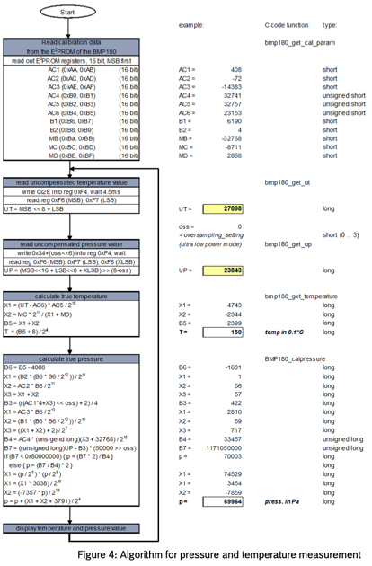

# RTEMS I2C driver for the Bosch BMP180 digital pressure sensor.
Datasheet: BST-BMP180-DS000-09 Rev 2.5, April 2013

## Architecture

The driver plugs into the RTEMS generic **I2C** framework (_libdev/i2c_).
Each sensor instance is represented by a `bmp180_dev_t` whose first member is an `i2c_dev` so that the framework can upcast safely.

The public interface exposed via the /dev node is:
```cpp
  ioctl(fd, BMP180_IOCTL_READ_MEASUREMENT,  &result)   // bmp180_measurement_t
  ioctl(fd, BMP180_IOCTL_SET_OSS,           &oss)      // bmp180_oss_t
  ioctl(fd, BMP180_IOCTL_GET_OSS,           &oss)      // bmp180_oss_t
  ioctl(fd, BMP180_IOCTL_SOFT_RESET)                   // no payload
  ioctl(fd, BMP180_IOCTL_SET_TEMP_INTERVAL, &ms)       // uint32_t
  ioctl(fd, BMP180_IOCTL_GET_TEMP_INTERVAL, &ms)       // uint32_t
```

Calibration coefficients are loaded once on the first measurement and cached in the device context.
`bmp180_register` reads only the chip ID; a registration that succeeds therefore proves the wiring, not the calibration.

The Bosch compensation algorithm is implemented verbatim from the datasheet section 3.5 (Figure 4) using `int32_t` / `int64_t` arithmetic to avoid floating-point dependencies.

The bus below the driver is `src/i2c.cpp`, a polled STM32F4 master for the same framework, since the BSP ships none.
It carries the bus recovery sequence: a slave left holding SDA by an interrupted transfer is clocked free rather than needing a power cycle.

## Sensor Conceptual flow highlighted in the docs


## Conceptual flow that the task follows

`bmp180_telemetry_task` (`src/sensor.cpp`) is the only reader in a normal build.

Code flow:
1. Device init: open the device in RW mode (`O_RDWR` from datasheet).
   - Early stop on error + `rtems_task_delete(RTEMS_SELF)` as usual.
2. Sensor Configuration:
   - The datasheet shows 4 possible run modes that i coded into a basic struct.
     ```cpp
     typedef enum {
       BMP180_OSS_ULTRA_LOW_POWER  = 0,
       BMP180_OSS_STANDARD         = 1,
       BMP180_OSS_HIGH_RESOLUTION  = 2,
       BMP180_OSS_ULTRA_HIGH_RES   = 3
     } bmp180_oss_t;
     ```
   - Sensor configuration handling is done via IOCTL calls (see section above).
3. Oversampling sweep: for each of the four modes, `SET_OSS`, then 3 discarded
   warm-up samples and 500 measured ones.
4. Continuous run at `BMP180_OSS_HIGH_RESOLUTION` for drift, jitter and
   self-heating analysis, until the board is reset.
5. Data Handling:
   - On failure: the errno is pushed as an `E` record and the loop continues.
     A read failure is data, not a reason to stop.
   - On success: timestamp, temperature, pressure and mode are pushed as an `S`
     record.

There is no inter-sample sleep and no print in the acquisition path, so
consecutive timestamps bound the true acquisition cycle time. Records are
drained to the console by a lower-priority emitter task, so the UART can never
delay a measurement; the wire format and the reasoning behind the split are in
`inc/telemetry.h`. Statistics are computed host-side — see `TESTING.md` §4.

## Application layer

`bmp_app` (`src/bmp_app.cpp`) sits above the driver so that more than one task
can use the sensor. One sampler task owns `/dev/bmp180-0` and publishes each
measurement into a snapshot; consumers read that snapshot without blocking and
without adding bus traffic, and change the mode or the temperature interval
through setters the sampler applies at the top of its next cycle.

That indirection is the point: consumers never hold an fd on the device, so
`oss` has exactly one writer and two consumers cannot fight over the mode.

```cpp
bmp_app_sample_t s;
if (bmp_app_read(&s)) { /* s.pressure_pa, s.t_us, s.oss, s.seq */ }

bmp_app_set_oss(BMP180_OSS_ULTRA_HIGH_RES);   /* applied next cycle */
```

Built only under `-DBMP_APP_TEST` for now; `bmp180_telemetry_task` still owns
the device in a default build. See `TESTING.md` §10.

## Build

Toolchain path comes from `../local.cmake` only (copy `local.cmake.example`).
`compile.sh`, `Makefile` and the root `CMakeLists.txt` all read it, and all
build with `-Wall -Wextra -Werror -std=c++17 -fno-exceptions -fno-rtti`.

```bash
./compile.sh          # or: make
make flash            # build + program the board over OpenOCD
make -C tests run     # host-side unit tests, no toolchain needed
```

Five build flags exist for tests that a normal build must not carry:
`-DBMP180_TEARDOWN_TEST`, `-DBMP180_CONCURRENCY_TEST`, `-DBMP180_NO_BUS_LOCK`,
`-DI2C_RECOVERY_TEST` and `-DBMP_APP_TEST`. See `TESTING.md`.
